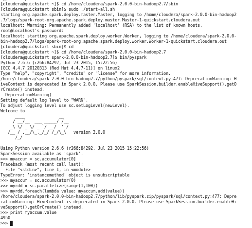
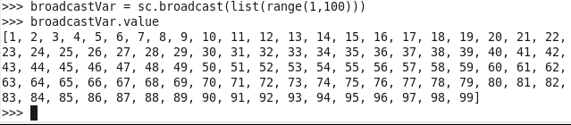
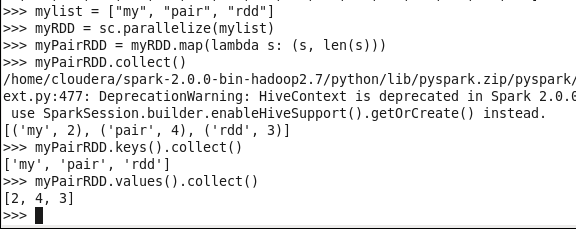
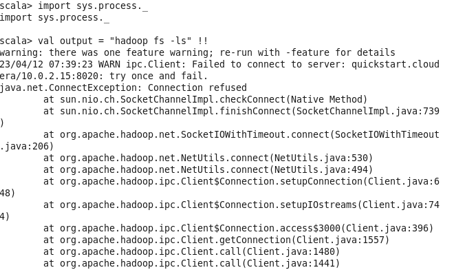
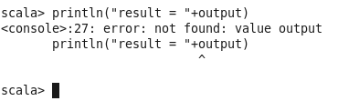
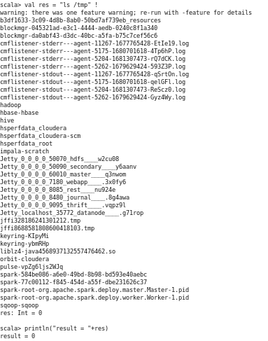
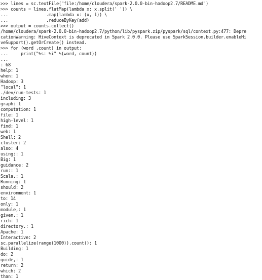

# chapter 3

tugas

## Nama

Nama: Achmad Wibawa.  
No: 01.
NIM: 2041720174.  
Kelas: TI-3B.

## Hasil Run

1. Accumulator.py

2. BroadCast.py

3. PairRDD.py

4. SystemCommandsOutput.scala
| |

5. SystemCommandsReturnCode.scala

6. WordCount.py

